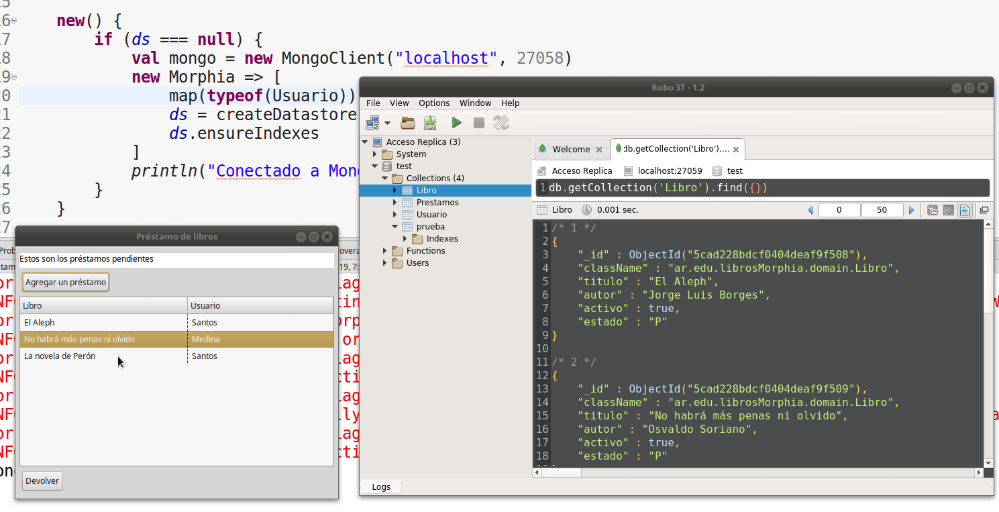
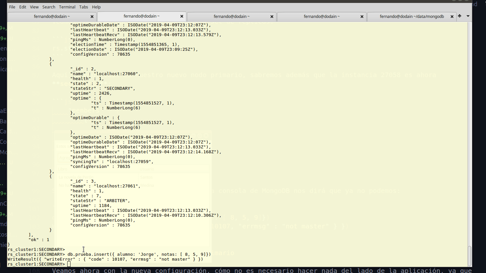
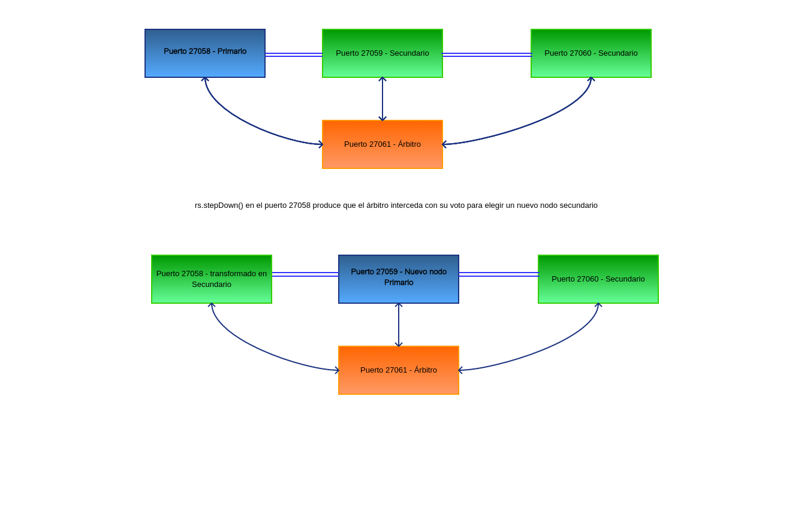

# Integración de una app con un esquema de replicación en MongoDB

Asumiendo que [ya tenés configuradas tres instancias de MongoDB](./replicacionTaller.md), avanzaremos con la creación de un nodo que oficiará de árbitro, todo en tu misma máquina.

La aplicación de los libros está en [este repositorio, en el branch replicaSet](https://github.com/uqbar-project/eg-libros-morphia/tree/replicaSet).

# Levantando un árbitro

Crearemos un directorio específico donde se escribirá el log de MongoDB:

```bash
cd ~/data/mongodb
mkdir arb
```

Y ahora sí levantamos el servicio de árbitro en una terminal bash:

```bash
mongod --port 27061 --dbpath ~/data/mongodb/arb --replSet rs_cluster1 --bind_ip "localhost"
```

En una consola de Mongo agregamos la instancia de árbitro:

```js
rs.addArb("localhost:27061")
rs.conf()
```

La configuración nos mostrará un nodo nuevo:

```js
    ...
    {
        "_id" : 3,
        "host" : "localhost:27061",
        "arbiterOnly" : true,
        "buildIndexes" : true,
        "hidden" : false,
        "priority" : 1,
        "tags" : {
            
        },
        "slaveDelay" : NumberLong(0),
        "votes" : 1
    }
    ...
```

Si vamos al ejemplo de los libros en Morphia, y modificamos el puerto al que nos conectamos:

```xtend
abstract class AbstractRepository<T> {

	static protected Datastore ds

	new() {
		if (ds === null) {
			val mongo = new MongoClient("localhost", 27058)
```

Podemos a su vez abrir una sesión de Robo3T y ver cómo los cambios impactan directamente en el nodo réplica:



## Conectándonos a un Replicaset

Cambiaremos ahora en la clase `AbstractRepository<T>` del mismo ejemplo de libros en Morphia para [conectarnos a múltiples réplicas de Mongo](https://github.com/uqbar-project/eg-libros-morphia/blob/replicaSet/src/main/java/ar/edu/librosMorphia/repos/AbstractRepository.xtend#L20):

```xtend
    val mongo = new MongoClient(#[new ServerAddress("localhost", 27058),
            new ServerAddress("localhost", 27059),
            new ServerAddress("localhost", 27060)])
```

## Cambiando el nodo primario

Parados en la instancia 27058, en la consola de Mongo, vamos a decir que declinamos ser el nodo primario:

```js
rs.stepDown()
```

Veamos ahora el nuevo estado de nuestro set de réplicas:

```js
rs.status()
```

Aquí veremos cuál es nuestro nuevo nodo primario, sabremos además que la instancia 27058 es ahora **secundaria**:

```js
	"members" : [
		{
			"_id" : 0,
			"name" : "localhost:27058",
			"health" : 1,
			"state" : 2,
			"stateStr" : "SECONDARY",
```

Si intentamos hacer un insert en la misma consola de MongoDB nos dirá que ya no podemos:

```js
db.prueba.insert({ alumno: 'Jorge', notas: [ 8, 5, 9]})
WriteResult({ "writeError" : { "code" : 10107, "errmsg" : "not master" } })
```

## Prueba de la app con el nuevo nodo primario

Veamos ahora con la nueva configuración, cómo no es necesario hacer nada del lado de la aplicación, ya que automáticamente pasamos a escribir en el nuevo nodo primario. Y la consulta se puede ver de inmediato en Robo3T:



En los logs de nuestra aplicación Xtend, vemos cómo fue el paso de un puerto hacia otro:

```bash
INFORMACIÓN: Opened connection [connectionId{localValue:6, serverValue:26}] to localhost:27058
abr 09, 2019 8:09:25 PM com.mongodb.diagnostics.logging.JULLogger log
INFORMACIÓN: Monitor thread successfully connected to server with description ServerDescription{address=localhost:27058, type=REPLICA_SET_SECONDARY, state=CONNECTED, ok=true, version=ServerVersion{versionList=[3, 4, 13]}, minWireVersion=0, maxWireVersion=5, maxDocumentSize=16777216, logicalSessionTimeoutMinutes=null, roundTripTimeNanos=1664149, setName='rs_cluster1', canonicalAddress=localhost:27058, hosts=[localhost:27058, localhost:27059, localhost:27060], passives=[], arbiters=[localhost:27061], primary='null', tagSet=TagSet{[]}, electionId=null, setVersion=78635, lastWriteDate=Tue Apr 09 20:09:14 ART 2019, lastUpdateTimeNanos=42914275494951}
abr 09, 2019 8:09:35 PM com.mongodb.diagnostics.logging.JULLogger log
INFORMACIÓN: Monitor thread successfully connected to server with description ServerDescription{address=localhost:27059, type=REPLICA_SET_PRIMARY, state=CONNECTED, ok=true, version=ServerVersion{versionList=[3, 4, 13]}, minWireVersion=0, maxWireVersion=5, maxDocumentSize=16777216, logicalSessionTimeoutMinutes=null, roundTripTimeNanos=1831553, setName='rs_cluster1', canonicalAddress=localhost:27059, hosts=[localhost:27058, localhost:27059, localhost:27060], passives=[], arbiters=[localhost:27061], primary='localhost:27059', tagSet=TagSet{[]}, electionId=7fffffff0000000000000006, setVersion=78635, lastWriteDate=Tue Apr 09 20:09:27 ART 2019, lastUpdateTimeNanos=42924271875835}
abr 09, 2019 8:09:35 PM com.mongodb.diagnostics.logging.JULLogger log
INFORMACIÓN: Monitor thread successfully connected to server with description ServerDescription{address=localhost:27060, type=REPLICA_SET_SECONDARY, state=CONNECTED, ok=true, version=ServerVersion{versionList=[3, 4, 13]}, minWireVersion=0, maxWireVersion=5, maxDocumentSize=16777216, logicalSessionTimeoutMinutes=null, roundTripTimeNanos=1875800, setName='rs_cluster1', canonicalAddress=localhost:27060, hosts=[localhost:27058, localhost:27059, localhost:27060], passives=[], arbiters=[localhost:27061], primary='localhost:27059', tagSet=TagSet{[]}, electionId=null, setVersion=78635, lastWriteDate=Tue Apr 09 20:09:27 ART 2019, lastUpdateTimeNanos=42924273293450}
abr 09, 2019 8:09:35 PM com.mongodb.diagnostics.logging.JULLogger log
INFORMACIÓN: Setting max election id to 7fffffff0000000000000006 from replica set primary localhost:27059
abr 09, 2019 8:09:35 PM com.mongodb.diagnostics.logging.JULLogger log
```

## Resumen arquitectura

