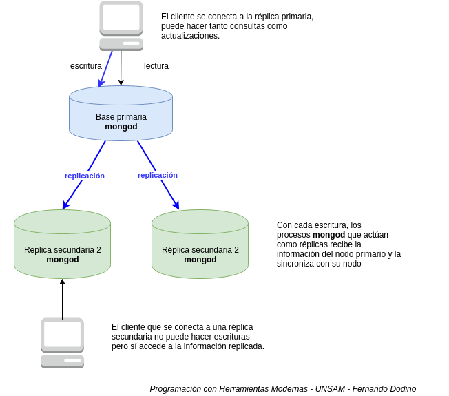
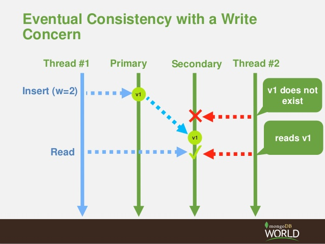

# Replicación

La replicación consiste en tener copias o _réplicas_ de una base de datos original. En la base de datos MongoDB esto se implementa con varios procesos:

* un proceso **mongod** central o nodo primario que procesa las actualizaciones y mantiene los documentos actualizados. A su vez en segundo plano (_background_) se genera un log con las novedades para...
* ...los otros procesos **mongod** que actúan como _replica set_ o nodos secundarios, reciben ese log y asincrónicamente actualizan la misma información.

Nosotros podemos conectarnos con un cliente (proceso **mongo**) a cualquiera de los nodos, pero **solo podremos insertar, actualizar o eliminar documentos en el nodo primario**.

## Definición del nodo primario

Cualquier nodo es elegible en primera instancia como nodo primario. A partir de aquí se establece que cada un cierto período de tiempo, cada nodo envía un _heartbeat_, indicando que está activo y listo para recibir actualizaciones.

Como hemos visto antes, un proceso **mongod** puede configurarse como nodo primario o secundario, pero también existe la figura del **árbitro** (_arbiter_), como mediador entre todos los nodos para escuchar los _heartbeats_ y en el caso de tener corriendo una cantidad par de instancias de Mongo, para desempatar los votos sobre qué nodo debe actuar como primario.

## Qué pasa cuando cae el nodo primario

Cuando el nodo primario sufre una falla, deja de enviar su _heartbeat_. El árbitro espera un tiempo prudencial (ya que puede haber un tiempo de latencia de la red), y cuando determina que el nodo primario está caído se lleva a cabo la votación por el nuevo nodo primario.

A partir de este momento, el nuevo nodo primario puede comenzar a recibir pedidos de los clientes. En promedio la documentación de MongoDB calcula que el proceso de detección de caída del nodo primario y la elección de un nuevo nodo puede llevar aproximadamente 12 segundos, dependiendo de la configuración y del tiempo de latencia de la red.

## Consistencia eventual

La replicación tiene **consistencia eventual**, lo que trae como consecuencia

* el nodo primario actualiza la información
* si hacemos la consulta a un nodo secundario, hay un momento en el que la información estará desactualizada, hasta que corra el proceso que regenere los datos

## Links útiles

* [Replicación - Manuales de MongoDB](https://docs.mongodb.com/manual/replication/)
* [Taller de Replicación](./replicacionTaller.md)
* [Replicación con una app en vivo](./replicacionApp.md)
