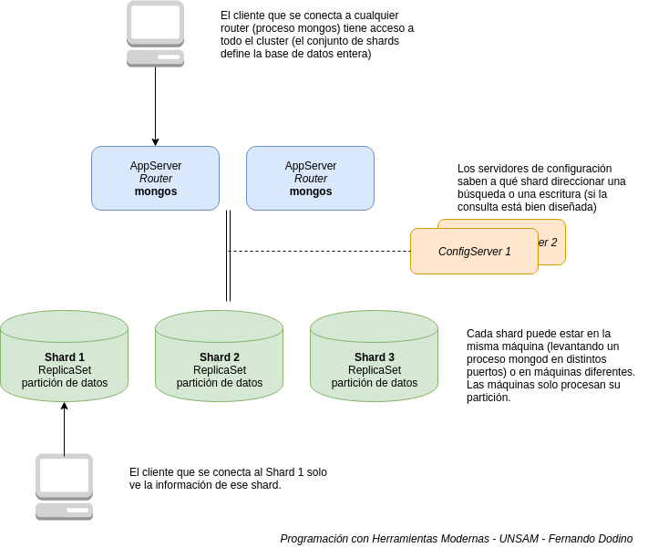

# Sharding

El sharding consiste en distribuir la información en varias máquinas. El particionamiento permite el **escalamiento horizontal**, donde al dividir grandes volúmenes de datos en particiones más chicas no necesitamos máquinas tan poderosas para resolver consultas (ya que tenemos menos datos para procesar). En contraposición, debemos tener ciertos recaudos en la configuración del sharding, como veremos más adelante.

## Material

* https://docs.mongodb.com/manual/sharding/
* https://docs.mongodb.com/manual/tutorial/deploy-shard-cluster/
* https://www.youtube.com/watch?v=qYzYp1bPCPg
* https://docs.mongodb.com/manual/tutorial/deploy-sharded-cluster-hashed-sharding/#deploy-hashed-sharded-cluster-shard-collection