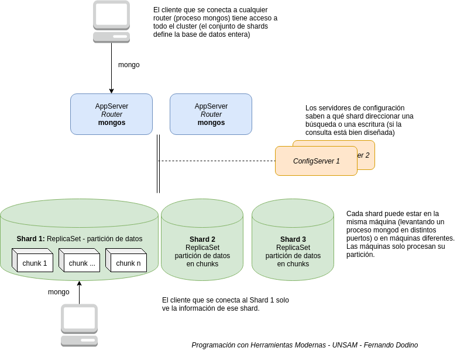
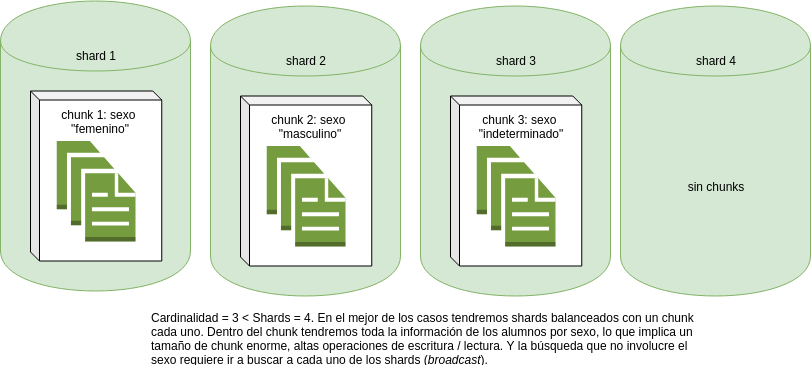
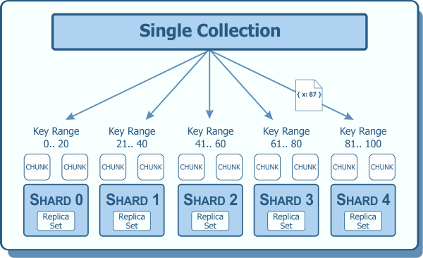

# Sharding

El sharding consiste en distribuir la información en varias máquinas. El particionamiento permite el **escalamiento horizontal**, donde al dividir grandes volúmenes de datos en particiones más chicas no necesitamos máquinas tan poderosas para resolver consultas (ya que tenemos menos datos para procesar). En contraposición, debemos tener ciertos recaudos en la configuración del sharding, como veremos más adelante.

## Diagrama general de la solución con sharding



### Shards

El cluster entero se divide en **shards**, cada uno de estos shards levanta un proceso `mongod` como un **replicaSet**. Los shards pueden estar en diferentes máquinas, o bien en la misma máquina y diferentes puertos. Con la unión de todos los shards tendremos la totalidad de los documentos que forman la base.

### Chunks y shard keys

Cada shard tiene un conjunto de **chunks** de 64 MB (aunque el tamaño se puede configurar). Los chunks agrupan documentos de similares características en base a la definición de la **shard key** o clave de particionamiento. Por ejemplo, en una base de alumnos de la facultad, una _shard key_ posible es el dígito verificador del legajo, otra el sexo, otra posibilidad es agrupar por año de nacimiento, otra por carrera y dígito verificador del legajo.

Para elegir una shard key, hay tres cosas fundamentales que debemos tener en cuenta:

- **alta cardinalidad** (_high cardinality_): la cardinalidad determina la cantidad máxima de chunks que podemos crear, dado que todos los documentos que tienen la misma shard key deben estar en el mismo chunk. Elegir una shard key en base al sexo de los alumnos produciría una situación como la siguiente:



> Incorporar más shards al cluster no tendría efecto, dado que nuestra clave tiene cardinalidad 3 que es menor a la cantidad de shards instalados. Por lo general, una shard key que produce menos de 50 valores se considera de **baja cardinalidad.**

Lo mismo ocurre con una clave que trabaja en base al dígito verificador del alumno, ya que tendremos solamente 10 chunks para distribuir en cada uno de nuestros shards. Una clave basada en el legajo tiene alta cardinalidad: entonces podemos agruparlos en chunks más pequeños y ajustar el tamaño de los chunks cuando un chunk ocupe más de 64 MB (o el valor que nosotros definamos).

- **baja frecuencia** (low frequency): se refiere a la probabilidad de ocurrencia o repetición de una clave, y está directamente relacionado con la cardinalidad. Una shard key de alumnos basada en el sexo, tiene una alta frecuencia. Una shard key basada en el legajo tiene una baja frecuencia, lo mismo que la clave basada en el apellido.

- **crecimiento uniforme en el tiempo** (non-monotonically changing in value): en el caso de una shard key basada en el dígito verificador tendremos una distribución proporcional de documentos en cada uno de los chunks. En el caso de una shard key basada en la carrera de un alumno, si tenemos carreras con pocas matrículas y otras con muy alta cantidad de inscriptos, esto no asegura un crecimiento uniforme en el tiempo. Para poder profundizar en este aspecto, necesitamos diferenciar distintos tipos de shard keys.

#### Ranged sharded keys

La estrategia por defecto es tener las _shard keys_ en base a un rango de valores. De esta manera los documentos con claves contiguas estarán en el mismo _chunk_ o _shard_. Por ejemplo, si definimos en la colección de alumnos una shard key por legajo:

```js
> sh.shardCollection("test.alumnos", { "legajo": 1 } )
```

Entonces los shards agrupan rangos de información, como vemos a continuación:



Esto facilita las búsquedas por un rango de legajos, dado que es muy probable que los alumnos compartan el mismo _chunk_ o el mismo _shard_:

```js
test.alumnos.find({ "legajo": { "$gte": 20, "$lte": 50 } })
```

De todas maneras esta clave **no acepta el crecimiento monótono**: a medida que se incorporan nuevos alumnos, es necesario correr el proceso que ajusta y distribuye los _chunks_ en forma equitativa, para evitar que haya un crecimiento desparejo de los _shards_.

También podemos elegir una shard key de más de dos campos, donde combinemos primero una clave de baja cardinalidad (como la carrera) y otra de alta (como el legajo):

```js
> sh.shardCollection("test.alumnos", { "carrera": 1, "legajo": 1 } )
```

Igualmente, elegir una _shard key_ que trabaja por rango solo tiene sentido si el tipo de consultas que vamos a hacer serán filtrando un rango de documentos que tome específicamente dicha clave. En cualquier otro caso donde hagamos una búsqueda puntual por carrera o legajo, nos conviene trabajar con shard keys que utilicen **índices hash**.

#### Hashed sharded keys


```js
sh.shardCollection( "test.alumnos", { "legajo" : "hashed" } )
```

Si la _shard key_ tiene una alta cardinalidad y baja frecuencia, y queremos asegurar una distribución uniforme entre shards, MongoDB provee una función de [**hashing**](https://en.wikipedia.org/wiki/Hash_function) automática, que funciona de la siguiente manera:

- se elige la shard key, por ejemplo, el legajo del usuario
- al insertar un documento, MongoDB utiliza la función de hash para convertir el número de legajo en un valor _x_
- el valor _x_ de hash es utilizado como entrada para determinar el _chunk_ (y por ende el _shard_) que ocupará

Dado que dos legajos contiguos tendrán un hash totalmente diferente, este tipo de configuración no es bueno para consultar los alumnos con legajo 15 al 20. Por otra parte, este tipo de clave eso nos asegura un crecimiento monótono de los _shards_, sin necesidad de un proceso que balancee los _chunks_.

### Splitter y balancer

Periódicamente corren dos procesos de fondo:

- el **splitter** que verifica que un nuevo documento insertado no lleve al chunk a exceder de su límite, en cuyo caso se parte el chunk en dos:


Esto necesita de definir una _shard key_ con alta cardinalidad y baja frecuencia, ya que todos los documentos que comparten la misma shard key deben permanecer en el mismo _chunk_. 

- Por otra parte, la creación de nuevos chunks puede llevar a que un shard tenga muchos más datos que otro, por eso un segundo proceso llamado **balancer** se encarga de mantener uniformes los chunks.


### Zones

### Algunos consejos

**Evitar las optimizaciones prematuras** es un consejo para la profesión en general, y aquí no hay excepciones: debe existir la necesidad concreta de particionar, y debemos tener en claro de qué manera crece la información de nuestro sistema, para poder elegir una _shard key_ lo suficientemente buena para no introducir un problema donde no lo había.

[Learn mongo the hard way](http://learnmongodbthehardway.com/schema/sharding/)

## Routers

La aplicación cliente (ya sea `mongo` o un driver) no se conecta directamente al proceso `mongod` del shard, sino al proceso `mongos` que actúa como router para redirigir las consultas o actualizaciones hacia un shard específico.

## Material

* https://docs.mongodb.com/manual/sharding/
* https://docs.mongodb.com/manual/tutorial/deploy-shard-cluster/
* https://www.youtube.com/watch?v=qYzYp1bPCPg
* https://www.youtube.com/watch?v=W3HhqMvwZP8
* https://docs.mongodb.com/manual/tutorial/deploy-sharded-cluster-hashed-sharding/#deploy-hashed-sharded-cluster-shard-collection

## Links

- [Taller](./shardingTaller.md)
- [Volver a la página principal](../README.md)