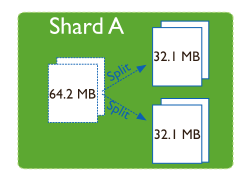
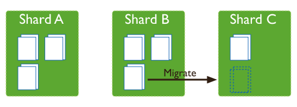

# Sharding

El sharding consiste en distribuir la información en varias máquinas. El particionamiento permite el **escalamiento horizontal**, donde al dividir grandes volúmenes de datos en particiones más chicas no necesitamos máquinas tan poderosas para resolver consultas (ya que tenemos menos datos para procesar). En contraposición, debemos tener ciertos recaudos en la configuración del sharding, como veremos más adelante.

## Diagrama general de la solución con sharding

### Shards y chunks

El cluster entero se divide en **shards**, cada uno de estos shards levanta un proceso `mongod` como un **replicaSet**. Los shards pueden estar en diferentes máquinas, o bien en la misma máquina y diferentes puertos. Con la unión de todos los shards tendremos la totalidad de los documentos que forman la base.

Cada shard tiene un conjunto de **chunks** de 64 MB (aunque el tamaño se puede configurar). Los chunks agrupan documentos de similares características en base a la definición de la **shard key**, que veremos a continuación.

### Routers para consultas o actualizaciones y shard keys

La aplicación cliente (ya sea `mongo` o un driver) no se conecta directamente al proceso `mongod` del shard, sino al proceso `mongos` que actúa como router para redirigir las consultas o actualizaciones hacia un shard específico. Para ello necesitamos definir la clave de particionamiento o **shard key** con el que vamos a saber a qué _chunk_ debe pertenecer un documento.

Tres cosas a tener en cuenta

- high cardinality: elegir una shard key que tenga tantos valores como sea posible, dado que todos los documentos que tienen la misma shard key deben estar en el mismo chunk. 
- low frequency: el dígito verificador hace que tengamos solo 10 valores, por lo tanto 10 chunks.
- non-monotonically changing in value: esto implica que el crecimiento sea uniforme en el tiempo. En el caso del dígito verificador esto ocurre, porque conforme aparezcan nuevos alumnos los valores 0, 1... 9 irán incorporando valores en forma proporcional. No pasaría esto si elegimos como clave el legajo, ya que claves con índices autoincrementales producen shards desproporcionados (el último shard tendría la mayoría de chunks).

#### Ranged sharded keys

Supongamos que manejamos la base de documentos de los alumnos de la facultad. Cada alumno tiene un legajo, un dígito verificador, el nombre, la carrera y la lista de materias cursadas. Podríamos pensar en armar una clave por dígito verificador, esto permite

- una distribución uniforme
- 

#### Hashed sharded keys

#### Zones

### Splitter y balancer

, entonces periódicamente corren dos procesos de fondo: el **splitter** que verifica que un nuevo documento insertado no lleve al chunk a exceder de su límite, en cuyo caso se parte el chunk en dos:

Por otra parte, la creación de nuevos chunks puede llevar a que un shard tenga muchos más datos que otro, por eso un segundo proceso llamado **balancer** se encarga de mantener uniformes los chunks.

https://www.youtube.com/watch?v=W3HhqMvwZP8

## Material

* https://docs.mongodb.com/manual/sharding/
* https://docs.mongodb.com/manual/tutorial/deploy-shard-cluster/
* https://www.youtube.com/watch?v=qYzYp1bPCPg
* https://docs.mongodb.com/manual/tutorial/deploy-sharded-cluster-hashed-sharding/#deploy-hashed-sharded-cluster-shard-collection