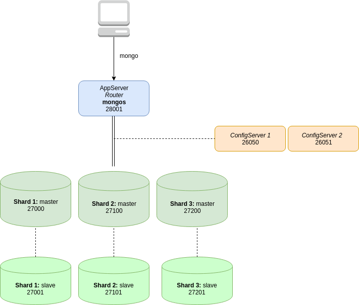

# Taller de Sharding

## Crear carpetas asociadas a los shards

Crear estas carpetas:

* ~/data/mongodb/sharding/shard1
* ~/data/mongodb/sharding/repl1
* ~/data/mongodb/sharding/shard2
* ~/data/mongodb/sharding/repl2
* ~/data/mongodb/sharding/shard3
* ~/data/mongodb/sharding/repl3
* ~/data/mongodb/sharding/cfg1
* ~/data/mongodb/sharding/cfg2 

`~` es el equivalente al directorio del usuario (`/home/fernando` o `C:\Users\Fernando`), principalmente por un tema de permisos.

En cada una configurar desde Git Bash o la consola Linux los siguientes permisos

```bash
cd ~/data/mongodb/sharding
mkdir cfg1 cfg2 shard1 shard2 shard3 repl1 repl2 repl3
sudo chmod 775 shard* cfg*
sudo chown -R `id -un` shard* cfg*
```

## Levantar los servers de configuración

> **IMPORTANTE:** Los comandos desde Git Bash no deben tener la configuración `--fork` al final sino deben levantar una terminal cada uno:

```bash
mongod --replSet rsConf --configsvr --port 26050 --logpath ~/data/mongodb/sharding/log.cfg1 --logappend --dbpath ~/data/mongodb/sharding/cfg1 --fork
mongod --replSet rsConf --configsvr --port 26051 --logpath ~/data/mongodb/sharding/log.cfg2 --logappend --dbpath ~/data/mongodb/sharding/cfg2 --fork
```

Te aparecerán los dos PID (process id) generados.

## Levantar shards (instancias de mongod)

```bash
mongod --shardsvr --replSet shard1 --dbpath ~/data/mongodb/sharding/shard1 --logpath ~/data/mongodb/sharding/log.shard1 --port 27000 --fork --logappend --oplogSize 50

mongod --shardsvr --replSet shard1 --dbpath ~/data/mongodb/sharding/repl1 --logpath ~/data/mongodb/sharding/log.repl1 --port 27001 --fork --logappend --oplogSize 50

mongod --shardsvr --replSet shard2 --dbpath ~/data/mongodb/sharding/shard2 --logpath ~/data/mongodb/sharding/log.shard2 --port 27100 --fork --logappend --oplogSize 50

mongod --shardsvr --replSet shard2 --dbpath ~/data/mongodb/sharding/repl2 --logpath ~/data/mongodb/sharding/log.repl2 --port 27101 --fork --logappend --oplogSize 50

mongod --shardsvr --replSet shard3 --dbpath ~/data/mongodb/sharding/shard3 --logpath ~/data/mongodb/sharding/log.shard3 --port 27200 --fork --logappend --oplogSize 50

mongod --shardsvr --replSet shard3 --dbpath ~/data/mongodb/sharding/repl3 --logpath ~/data/mongodb/sharding/log.repl3 --port 27201 --fork --logappend --oplogSize 50
```

## Verificación previa

Si ejecutamos este comando:

```bash
ps -fe | grep mongo
```

deberíamos ver 8 procesos, dos correspondientes a los config servers y seis con los shards. Todos son procesos `mongod` (ignoremos el grep):

```bash
fernando 24798     1  1 20:51 ?        00:00:02 mongod --replSet rsConf --configsvr --port 26050 --logpath /home/fernando/data/mongodb/sharding/log.cfg1 --logappend --dbpath /home/fernando/data/mongodb/sharding/cfg1 --fork
fernando 24843     1  1 20:51 ?        00:00:02 mongod --replSet rsConf --configsvr --port 26051 --logpath /home/fernando/data/mongodb/sharding/log.cfg2 --logappend --dbpath /home/fernando/data/mongodb/sharding/cfg2 --fork
fernando 24971     1  1 20:52 ?        00:00:01 mongod --shardsvr --replSet shard1 --dbpath /home/fernando/data/mongodb/sharding/repl1 --logpath /home/fernando/data/mongodb/sharding/log.repl1 --port 27001 --fork --logappend --oplogSize 50
fernando 25012     1  1 20:52 ?        00:00:01 mongod --shardsvr --replSet shard2 --dbpath /home/fernando/data/mongodb/sharding/shard2 --logpath /home/fernando/data/mongodb/sharding/log.shard2 --port 27100 --fork --logappend --oplogSize 50
fernando 25050     1  1 20:52 ?        00:00:01 mongod --shardsvr --replSet shard2 --dbpath /home/fernando/data/mongodb/sharding/repl2 --logpath /home/fernando/data/mongodb/sharding/log.repl2 --port 27101 --fork --logappend --oplogSize 50
fernando 25088     1  1 20:52 ?        00:00:01 mongod --shardsvr --replSet shard3 --dbpath /home/fernando/data/mongodb/sharding/shard3 --logpath /home/fernando/data/mongodb/sharding/log.shard3 --port 27200 --fork --logappend --oplogSize 50
fernando 25128     1  1 20:52 ?        00:00:01 mongod --shardsvr --replSet shard3 --dbpath /home/fernando/data/mongodb/sharding/repl3 --logpath /home/fernando/data/mongodb/sharding/log.repl3 --port 27201 --fork --logappend --oplogSize 50
fernando 25310     1  3 20:54 ?        00:00:00 mongod --shardsvr --replSet shard1 --dbpath /home/fernando/data/mongodb/sharding/shard1 --logpath /home/fernando/data/mongodb/sharding/log.shard1 --port 27000 --fork --logappend --oplogSize 50
```

## Levantando el servicio de ruteo

Ingresamos a un cliente mongo que se conecte a un config server:

```bash
mongo --port 26050
```

Ahora configuraremos el replicaSet de los configServer:

```js
cfg={_id:"rsConf",members:[{_id:0 ,host: "127.0.0.1:26050"}, {_id: 1, host: "127.0.0.1:26051" }]}
rs.initiate(cfg)
exit
```

Hay que asegurarse de que

- el nombre `rsConf` es el mismo que le dimos a los nombres de los replica set correspondientes a los configuration servers
- que los puertos donde levantamos los config servers son 26050 y 26051
- que levantamos los servicios `mongod` como replica set

## Configurar sharding

Ahora ingresaremos a cada uno de los nodos y configuraremos el replicaSet de cada shard:

```bash
mongo --port 27000
```

Configuraremos primary y secondary para shard1:

```js
cfg={_id:"shard1", members:[{_id:0 ,host: "127.0.0.1:27000"}, {_id:1 ,host: "127.0.0.1:27001" }]}
rs.initiate(cfg)
rs.status()
exit
```

Hacemos lo mismo con los otros dos shards:

```bash
mongo --port 27100
```

```js
cfg={_id:"shard2", members:[{_id:0 ,host: "127.0.0.1:27100"}, {_id:1 ,host: "127.0.0.1:27101" }]}
rs.initiate(cfg)
rs.status()
exit
```

Y finalmente:

```bash
mongo --port 27200
```

```js
cfg={_id:"shard3", members:[{_id:0 ,host: "127.0.0.1:27200"}, {_id:1 ,host: "127.0.0.1:27201"}]}
rs.initiate(cfg)
rs.status()
exit
```

## Iniciar sharding

Levantaremos ahora los servicios de ruteo:

```bash
mongos --configdb rsConf/127.0.0.1:26050,127.0.0.1:26051 --fork --logappend --logpath ~/data/mongodb/shardlog --port 28001 --bind_ip 127.0.0.1
```

Si vemos un mensaje como el siguiente

```bash
2019-05-07T19:28:58.716-0300 W SHARDING [main] Running a sharded cluster with fewer than 3 config servers should only be done for testing purposes and is not recommended for production.
about to fork child process, waiting until server is ready for connections.
forked process: 17925
child process started successfully, parent exiting
```

es que hemos conseguido tener levantado nuestra arquitectura!



## Conectándonos al router

Bajate el archivo [facts.js](../../scripts/facts.js) que está en este repositorio, y ubicalo en el raíz donde estés trabajando.

Abriremos ahora una sesión cliente de mongo:

```bash
mongo --port 28001
```

Dentro del shell del router, le definiremos los tres shards:

```js
sh.addShard("shard1/127.0.0.1:27000")
sh.addShard("shard2/127.0.0.1:27100")
sh.addShard("shard3/127.0.0.1:27200")
```

Si todo anduvo ok, vas a ver los tres shards y sus réplicas con este comando:

```js
db.adminCommand( { listShards: 1 } )
{
	"shards" : [
		{
			"_id" : "shard1",
			"host" : "shard1/127.0.0.1:27000,127.0.0.1:27001",
			"draining" : true,
			"state" : 1
		},
		{
			"_id" : "shard2",
			"host" : "shard2/127.0.0.1:27100,127.0.0.1:27101",
			"state" : 1
		},
		{
			"_id" : "shard3",
			"host" : "shard3/127.0.0.1:27200,127.0.0.1:27201",
			"state" : 1
		}
	],
	"ok" : 1,
	"operationTime" : Timestamp(1557273747, 1),
	"$clusterTime" : {
		"clusterTime" : Timestamp(1557273747, 1),
		"signature" : {
			"hash" : BinData(0,"AAAAAAAAAAAAAAAAAAAAAAAAAAA="),
			"keyId" : NumberLong(0)
		}
	}
}
```

Siempre dentro del shell, crearemos una database `finanzas` y cargaremos las 30.000 facturas, para lo cual es importante que ubiques el lugar donde se encuentre el archivo `facts.js` que te descargaste antes:

```js
use finanzas
load("facts.js")  // revisá en qué directorio lo descargaste
```

Ahora podés probar cuántas facturas hay cargadas:

```js
db
finanzas  // la base es finanzas
db.facturas.count()
30870
```

Abrimos 3 ventanas, conectándonos cada una al shard 1, 2 ó 3 primario:

```bash
mongo --port 27000  -- luego 27100, y 27200
```

y vemos dónde están las facturas:

```js
use finanzas
db.facturas.count()
```

El resultado te sorprenderá! Jajaja, volvamos al cliente que apunta al router (el del puerto 28001):

## Definiendo la shard key -> por rango

```js
use finanzas

-- creamos el índice de facturas por región y condición de pago
db.facturas.ensureIndex({"cliente.region":1,"condPago":1})

-- habilitamos el sharding para la database finanzas
sh.enableSharding("finanzas")

-- definimos la clave por el índice que anteriormente generamos (región y condición de pago ascendente)
sh.shardCollection("finanzas.facturas", {"cliente.region":1,"condPago":1 },false)

-- vemos los chunks que se generaron
use config
db.chunks.find({},
{min:1,max:1,shard:1,_id:0,ns:1}).pretty()

-- corremos muuuuuchas veces más el mismo script (7 veces mínimo)
load("scripts/facts.js")
load("scripts/facts.js")
load("scripts/facts.js")
load("scripts/facts.js")
load("scripts/facts.js")
load("scripts/facts.js")
load("scripts/facts.js")
```

Y volvemos a ejecutar el query de chunks:

```js
use config
db.chunks.find({}, {min:1,max:1,shard:1,_id:0,ns:1}).pretty()
```

Nos conectamos a cada shard para buscar una factura contado de CABA:

```js
db.facturas.find({"cliente.region": "CABA", "condPago": "CONTADO" }).limit(2).pretty()
```

Podemos igualmente forzar un split manualmente:

```js
sh.splitAt("finanzas.facturas", { "cliente.region": "CENTRO", condPago: "EFECTIVO"  })
```

Esto ahora produce que en el router veamos

```js
use finanzas
db.facturas.count()
176880
```

mientras que en el tercer shard (o aquel donde teníamos todos los documentos)

```js
use finanzas
db.facturas.count()
123480
```

Podríamos definir una clave _hashed_, pero eso ya no es tan fácil ahora que hemos definido los shards:

```js
sh.shardCollection("finanzas.facturas", { "id": "hashed" })
{
	"ok" : 0,
	"errmsg" : "sharding already enabled for collection finanzas.facturas with options { _id: \"finanzas.facturas\", lastmodEpoch: ObjectId('5cd2295e081f213b3f3044c3'), lastmod: new Date(4294967296), dropped: false, key: { cliente.region: 1.0, condPago: 1.0 }, unique: false, uuid: UUID(\"2e521d61-3e0d-4646-8884-15d1dbc63300\") }",
	"code" : 23,
	"codeName" : "AlreadyInitialized",
	"operationTime" : Timestamp(1557277375, 4),
	"$clusterTime" : {
		"clusterTime" : Timestamp(1557277375, 4),
		"signature" : {
			"hash" : BinData(0,"AAAAAAAAAAAAAAAAAAAAAAAAAAA="),
			"keyId" : NumberLong(0)
		}
	}
}
```

## Otra oportunidad! Otra oportunidad!

Si ingresamos al directorio y eliminamos los shards

```bash
cd ~/data/mongodb/sharding
rm -rf cfg1 cfg2 shard1 shard2 shard3 repl1 repl2 repl3
```

Podemos volver a hacer el taller, pero ahora cambiaremos la configuración para utilizar un índice hashed. Salteamos cuando llegamos al párrafo "Definiendo la shard key -> por rango" y seguimos con esta opción.

## Definiendo la shard key -> hashed

```js
use finanzas

-- creamos el índice de facturas por hash del número, lo que asegurará buena dispersión
db.facturas.ensureIndex({"nroFactura": "hashed"})

-- habilitamos el sharding para la database finanzas
sh.enableSharding("finanzas")

-- definimos la clave por el índice que anteriormente generamos (región y condición de pago ascendente)
sh.shardCollection("finanzas.facturas", {"nroFactura": "hashed" }, false)

-- corremos el mismo script varias veces
load("scripts/facts.js")
load("scripts/facts.js")
load("scripts/facts.js")
load("scripts/facts.js")
load("scripts/facts.js")

-- vemos los chunks que se generaron
use config
db.chunks.find({}, {min:1,max:1,shard:1,_id:0,ns:1}).pretty()
```

O bien, mucho más claro,

```js
use finanzas
db.facturas.getShardDistribution()
```


Y ahora sí:

```
Shard shard03 at shard03/shard03a:27020,shard03b:27020
 data : 34.87MiB docs : 111089 chunks : 2
 estimated data per chunk : 17.43MiB
 estimated docs per chunk : 55544

Shard shard01 at shard01/shard01a:27018,shard01b:27018
 data : 36.32MiB docs : 115896 chunks : 2
 estimated data per chunk : 18.16MiB
 estimated docs per chunk : 57948

Shard shard02 at shard02/shard02a:27019,shard02b:27019
 data : 35.29MiB docs : 112585 chunks : 2
 estimated data per chunk : 17.64MiB
 estimated docs per chunk : 56292

Totals
 data : 106.49MiB docs : 339570 chunks : 6
 Shard shard03 contains 32.74% data, 32.71% docs in cluster, avg obj size on shard : 329B
 Shard shard01 contains 34.1% data, 34.13% docs in cluster, avg obj size on shard : 328B
 Shard shard02 contains 33.14% data, 33.15% docs in cluster, avg obj size on shard : 328B

```

Podemos entrar en cada uno de los shards (mongod en lugar del mongos):

```bash
mongo --port 27000
```

Y vemos cuántas facturas se generaron:

```js
use finanzas
db.facturas.count()
// 52680 --> es un estimativo
```

Lo mismo hacemos en el 27100 (en el ejemplo nos dio 51.175) y en el 27200 (50.495)

## Links

- http://juanroy.es/es/how-to-set-up-a-mongodb-sharded-cluster/
- https://www.bit.es/knowledge-center/mongodb-para-big-data-replicacion-y-sharding-iii/
- https://medium.com/@tudip/mongodb-sharding-replication-and-clusters-d95a6595bd2c
