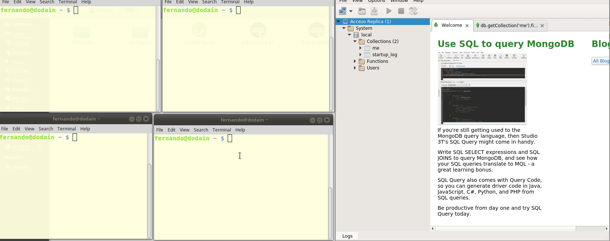

# Replicación

## Taller para generar réplicas en MongoDB

Vamos a crear 3 réplicas mediante un archivo de Docker Compose, si querés ver cómo se implementa en forma manual podés chequear [esta otra página](./replicacionTallerManual.md).

Crearemos un conjunto de 3 réplicas, cada una con su container. Si bien en cada container estarán usando internamente el puerto 27017, se van a asociar a los puertos de nuestra máquina como 27058, 27059 y 27060 respectivamente.

### Configuración de hosts

Agregar en `/etc/hosts` la asociación entre cada instancia de mongo que vamos a levantar:

```bash
127.0.0.1   localhost mongo1 mongo2 mongo3
```

Ejecutamos

```bash
./start-replicaset-environment.sh
```

### Conexión desde uno de los containers

Y ya podemos acceder a nuestro cluster 1 para agregar información. Podemos conectarnos al container de Docker:

```bash
docker exec -it mongo1 bash
```

Y le pedimos levantar el shell:

```bash
mongosh  # no hace falta poner --port porque dentro del container usamos el puerto 27017, el default
```

### Conexión mediante Studio3T

Si nos conectamos a Studio3T, al puerto 27058 podemos utilizar la siguiente URI:

```uri
mongodb://127.0.0.1:27058/?retryWrites=false&serverSelectionTimeoutMS=2000&connectTimeoutMS=10000&3t.uriVersion=3&3t.connection.name=Replicaci%C3%B3n&3t.alwaysShowAuthDB=true&3t.alwaysShowDBFromUserRole=true
```

Luego creamos una conexión y accedemos al replicaset:


## Inserción de datos

Ejecutemos en la instancia primaria este script:

```js
db.prueba.insert({ x:100})
db.prueba.insert({ x:200})
db.prueba.insert({ x:300, y:200 })
db.prueba.find()
```

Vemos ahora la configuración de las réplicas:

```js
rs_cluster1:PRIMARY> rs.conf()
{
	"_id" : "rs_cluster1",
	"version" : 78634,
	"protocolVersion" : NumberLong(1),
	"members" : [
		{
			"_id" : 0,
			"host" : "localhost:27058",
			"arbiterOnly" : false,
			"buildIndexes" : true,
			"hidden" : false,
			"priority" : 1,
			"tags" : {
				
			},
			"slaveDelay" : NumberLong(0),
			"votes" : 1
		},
		{
			"_id" : 1,
			"host" : "localhost:27059",
			"arbiterOnly" : false,
			"buildIndexes" : true,
			"hidden" : false,
			"priority" : 1,
			"tags" : {
				
			},
			"slaveDelay" : NumberLong(0),
			"votes" : 1
		},
		{
			"_id" : 2,
			"host" : "localhost:27060",
			"arbiterOnly" : false,
			"buildIndexes" : true,
			"hidden" : false,
			"priority" : 1,
			"tags" : {
				
			},
			"slaveDelay" : NumberLong(0),
			"votes" : 1
		}
	],
	"settings" : {
		"chainingAllowed" : true,
		"heartbeatIntervalMillis" : 2000,
		"heartbeatTimeoutSecs" : 10,
		"electionTimeoutMillis" : 10000,
		"catchUpTimeoutMillis" : 60000,
		"getLastErrorModes" : {
			
		},
		"getLastErrorDefaults" : {
			"w" : 1,
			"wtimeout" : 0
		},
		"replicaSetId" : ObjectId("5c88dbd531e2e061dcaa2d8b")
	}
}
```

Abrimos una sesión en Robo3T, accediendo a localhost:27059 (la réplica):

```js
db.getCollection('prueba').find({})
```

## Demo



## Las réplicas son de solo lectura

> **Tip importante**: antes de ejecutar cualquier query en una réplica, debemos ejecutar el comando `rs.slaveOk()` o nos aparecerá el mensaje `not master and slaveOk=false`

Exactamente, si nos conectamos a alguna de las réplicas

```bash
mongosh --port 27059
...
rs_cluster1:SECONDARY> 
```

E intentamos agregar un elemento a la colección `prueba`, obtendremos un mensaje de error:

```js
db.prueba.insert({x: 50, y: 20, z: 10})
WriteResult({ "writeError" : { "code" : 10107, "errmsg" : "not master" } })
```

Efectivamente, nos dice que no estamos en master.

## Resumen de la arquitectura


## Material

- [Conceptos de replicación](https://docs.mongodb.com/manual/replication/)
- [Deploy](https://docs.mongodb.com/manual/tutorial/deploy-replica-set/)

## Links

- [Volver al menú principal](../README.md)
- [Volver a particionamiento](../particionamiento.md)
