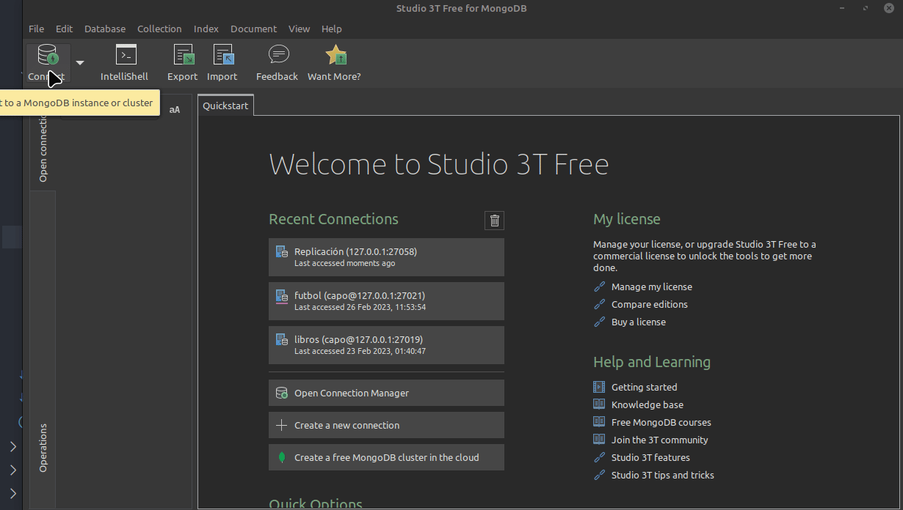
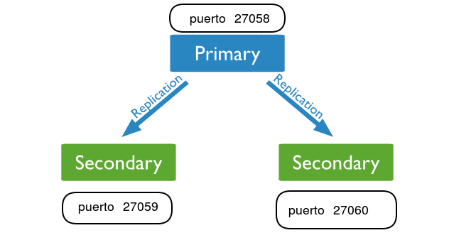
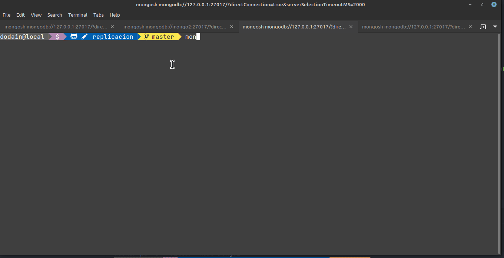
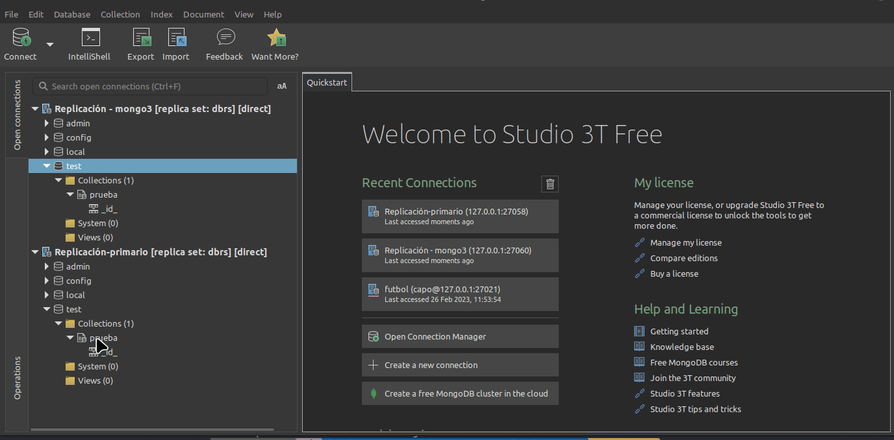

# Replicación

## Taller para generar réplicas en MongoDB

Vamos a crear 3 réplicas mediante un archivo de Docker Compose, si querés ver cómo se implementa en forma manual podés chequear [esta otra página](./replicacionTallerManual.md).

Crearemos un conjunto de 3 réplicas, cada una con su container. Si bien en cada container estarán usando internamente el puerto 27017, se van a asociar a los puertos de nuestra máquina como 27058, 27059 y 27060 respectivamente.

### Configuración de hosts

Agregar en `/etc/hosts` la asociación entre cada instancia de mongo que vamos a levantar:

```bash
127.0.0.1   localhost mongo1 mongo2 mongo3 mongo4
```

Levantamos primero las instancias de mongo:

```bash
docker compose up -d
```

Y ahora ejecutamos el script de configuración:

```bash
docker exec mongo1 /scripts/rs-init.sh
```

A partir de aquí ya podemos trabajar con replicación.

### Conexión desde uno de los containers

Y ya podemos acceder a nuestro cluster 1 para agregar información. Podemos conectarnos al container de Docker:

```bash
docker exec -it mongo1 bash
```

Y le pedimos levantar el shell:

```bash
mongosh  # no hace falta poner --port porque dentro del container usamos el puerto 27017, el default
```

### Conexión mediante Studio3T

Si nos conectamos a Studio3T, al puerto 27058 podemos utilizar la siguiente URI:

```uri
mongodb://127.0.0.1:27058/?retryWrites=false&serverSelectionTimeoutMS=2000&connectTimeoutMS=10000&3t.uriVersion=3&3t.connection.name=Replicaci%C3%B3n+-+primario&3t.alwaysShowAuthDB=true&3t.alwaysShowDBFromUserRole=true
```

Luego creamos una conexión y accedemos al replicaset:



## Arquitectura: configuración e inicio

La arquitectura consiste en una instancia de mongo que actúa como nodo primario (en el puerto 27058) y dos secundarios (puertos 27059 y 27060 respectivamente)



Cada uno de estos puertos mapea diferentes contenedores Docker de imágenes de Mongo:

- 27058 - primario - contenedor mongo1
- 27059 - secundario - contenedor mongo2
- 27060 - secundario - contenedor mongo3


## Escrituras y lecturas en un esquema con replicación

### Inserción de datos en el nodo principal

Ejecutemos en la instancia primaria este script:

```js
db.prueba.insert({ x:100})
```

### Lectura desde una réplica

Abrimos una sesión, accediendo a localhost:27060 (la réplica). Podés usar esta URI desde Studio 3T:

```uri
mongodb://127.0.0.1:27060/?retryWrites=false&serverSelectionTimeoutMS=2000&connectTimeoutMS=10000&3t.uriVersion=3&3t.connection.name=Replicaci%C3%B3n+-+mongo3&3t.alwaysShowAuthDB=true&3t.alwaysShowDBFromUserRole=true
```

```js
db.prueba.find();
```

Nos aparece a continuación un mensaje de error

```bash
MongoServerError: not primary and secondaryOk=false - consider using db.getMongo().setReadPref() or readPreference in the connection string
```

Configuramos este nodo para que por defecto lea la información localmente de la réplica:

```js
db.getMongo().setReadPref("secondary")
```

Ahora sí podemos hacer un find de la colección `prueba`:

```js
db.prueba.find()
[ { _id: ObjectId("644fb841bbceb74b685708ea"), x: 100 } ]
```



Lo mismo podemos hacer desde Studio 3T con ambas conexiones:




## Las réplicas son de solo lectura

Si nos conectamos a alguna de las réplicas

```bash
docker exec -it mongo2 bash
mongosh
```

E intentamos agregar un elemento a la colección `prueba`, obtendremos un mensaje de error:

```js
dbrs [direct: secondary] test> db.prueba.insertOne({x: 50, y: 20, z: 10})
MongoServerError: not primary
```

Efectivamente, nos dice que no estamos en master.

## Material

- [Conceptos de replicación](https://docs.mongodb.com/manual/replication/)
- [Deploy](https://docs.mongodb.com/manual/tutorial/deploy-replica-set/)

## Links

- [Volver al menú principal](../README.md)
