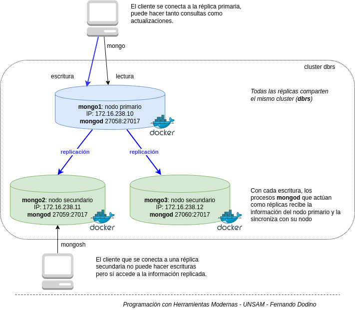
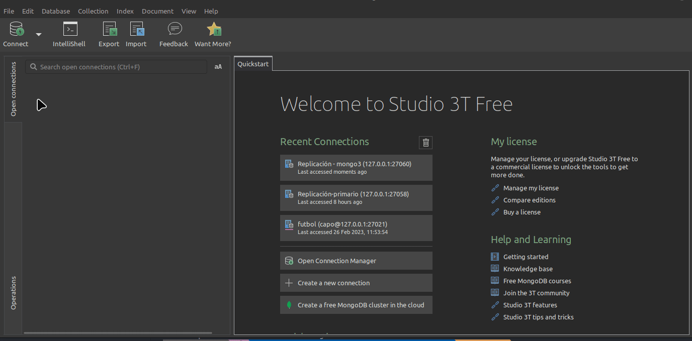
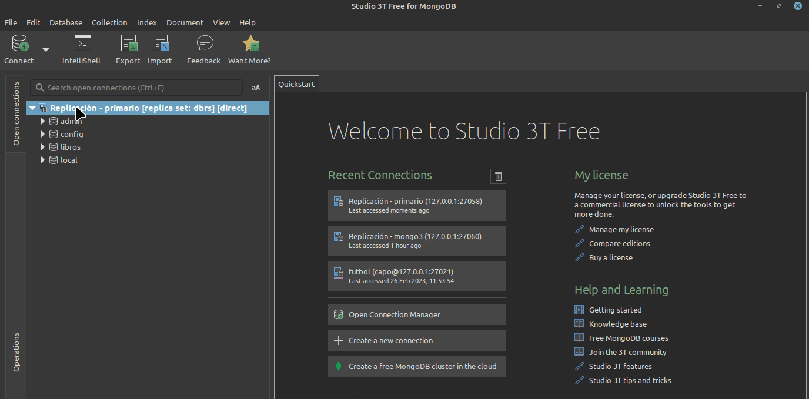
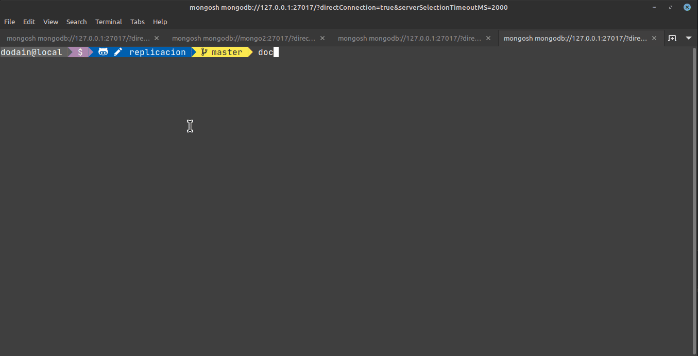
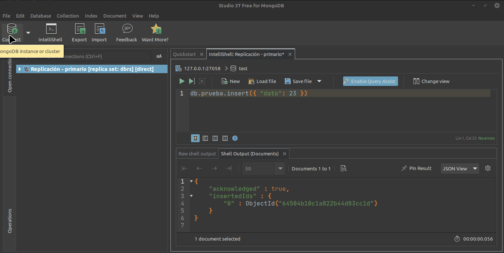
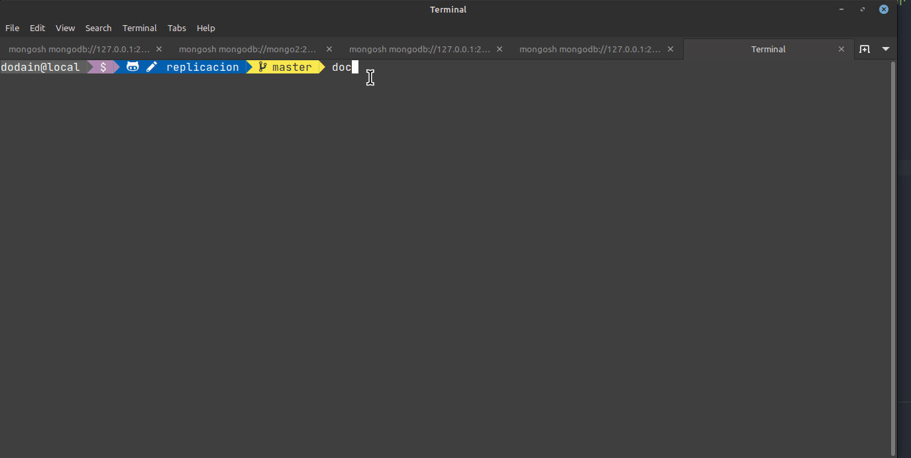

# Replicación

## Taller para generar réplicas en MongoDB

Si querés ver cómo se implementa en forma manual podés chequear [esta otra página](./replicacionTallerManual.md).

Mediante la definición de nuestro archivo `docker-compose.yml`, crearemos un conjunto de 3 réplicas, cada una con su container que usará  internamente el puerto 27017. En nuestra máquina se asociarán a los puertos de nuestra máquina como 27058, 27059 y 27060 respectivamente.

## Arquitectura: configuración e inicio

La arquitectura consiste en una instancia de mongo que actúa como nodo primario (en el puerto 27058) y dos secundarios (puertos 27059 y 27060 respectivamente)



Cada uno de estos puertos mapea diferentes contenedores Docker de imágenes de Mongo:

- 27058 - primario - contenedor mongo1
- 27059 - secundario - contenedor mongo2
- 27060 - secundario - contenedor mongo3

Hay un cuarto nodo, 27061 que utilizaremos [más adelante para la app](./replicacionApp.md).

Pero como no tenemos instalado el cliente Mongo en nuestra máquina, en lugar de acceder al shell de Mongo con los puertos que expone cada container de Docker vamos a entrar al contenedor en base al nombre (mongo1, mongo2 o mongo3) y desde allí ejecutar el comando `mongosh` (anteriormente mongo). Cada contenedor tiene su propia IP dentro de una subred propia del cluster de Mongo (el que conforma **un conjunto de réplicas o replicaset**), algo que nos será muy útil cuando levantemos este esquema en una aplicación Springboot.

## Levantando los contenedores

Activemos primero todas las instancias de mongo:

```bash
docker compose up -d
```

Una vez que estén levantados todos los servicios, ejecutemos ahora el script de configuración del replicaset:

```bash
docker exec mongo1 /scripts/rs-init.sh
```

Este script define:

- que el esquema de replicación trabaja con el contenedor mongo1 como nodo primario,
- mongo2 y mongo3 funcionan como nodos secundarios
- y por último se crea el usuario admin en la base de datos admin

A partir de aquí ya podemos trabajar con replicación.

## Conexión a Mongo

### Opción 1: Conexión desde uno de los containers

Y ya podemos acceder a nuestro cluster 1 para agregar información. Podemos conectarnos al container de Docker:

```bash
docker exec -it mongo1 bash
```

Y le pedimos levantar el shell:

```bash
# no hace falta poner --port porque dentro del container usamos el puerto 27017, el default
# tampoco usuario ni password
mongosh --retryWrites=false # importante es el parámetro de referencia
```

### Opción 2: Conexión mediante Studio3T

Si nos conectamos a Studio3T podemos utilizar la siguiente URI para conectarnos al nodo primario:

```uri
mongodb://127.0.0.1:27058/?retryWrites=false&serverSelectionTimeoutMS=2000&connectTimeoutMS=10000&3t.uriVersion=3&3t.connection.name=Replicaci%C3%B3n+-+primario&3t.alwaysShowAuthDB=true&3t.alwaysShowDBFromUserRole=true
```

Las opciones para conectarnos al nodo primario son:

- utilizar la IP localhost: `127.0.0.1` y el puerto `27058` (el que publica el contenedor)
- utilizar la IP propia del contenedor: `172.16.238.10` y el puerto `27017` (el que usa internamente el contenedor)

Luego creamos una conexión y accedemos al replicaset:



> IMPORTANTE: no crees a mano una conexión utilizando `Replica Set`, dado que no está funcionando. Trabajá únicamente importando la URI.
 
## Escrituras y lecturas en un esquema con replicación

### Inserción de datos en el nodo principal

Creamos una base de datos `test` y ejecutamos en la instancia primaria una inserción:

```js
db.prueba.insertOne({ "dato": 23 })
```

Esto lo podemos hacer desde Studio 3T:



O bien desde una instancia `mongo1`:



### Lectura desde una réplica

Abrimos una sesión, accediendo a localhost:27060 (la réplica). Podés usar esta URI desde Studio 3T:

```uri
mongodb://127.0.0.1:27060/?retryWrites=false&serverSelectionTimeoutMS=2000&connectTimeoutMS=10000&3t.uriVersion=3&3t.connection.name=Replicaci%C3%B3n+-+mongo3&3t.alwaysShowAuthDB=true&3t.alwaysShowDBFromUserRole=true
```

```js
db.prueba.find();
```



También podemos hacerlo desde el contenedor de Docker:

```bash
docker exec -it mongo3 bash
mongosh
```

Vemos que al tratar de ver la información de la colección (`db.prueba.find();`), nos aparece un mensaje de error:

```bash
MongoServerError: not primary and secondaryOk=false - consider using db.getMongo().setReadPref() or readPreference in the connection string
```

Configuramos el nodo para que por defecto lea la información localmente de la réplica:

```js
db.getMongo().setReadPref("secondary")
```

Para más información pueden ver [esta página](https://www.mongodb.com/docs/manual/core/read-preference/). Ahora sí podemos hacer un find de la colección `prueba`.




## Las réplicas son de solo lectura

Si nos conectamos a alguna de las réplicas

```bash
docker exec -it mongo2 bash
mongosh
```

E intentamos agregar un elemento a la colección `prueba`, obtendremos un mensaje de error:

```js
dbrs [direct: secondary] test> db.prueba.insertOne({x: 50, y: 20, z: 10})
MongoServerError: not primary
```

Efectivamente, nos dice que no estamos en el nodo primario.

## Material

- [Conceptos de replicación](https://docs.mongodb.com/manual/replication/)
- [Deploy](https://docs.mongodb.com/manual/tutorial/deploy-replica-set/)

## Links

- [Usando replicación en una aplicación](./replicacionApp.md)
- [Volver al menú principal](../README.md)
