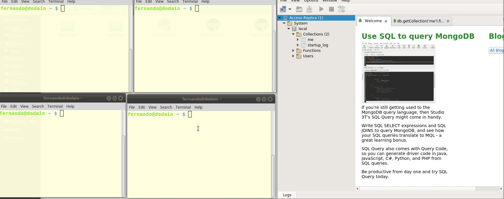
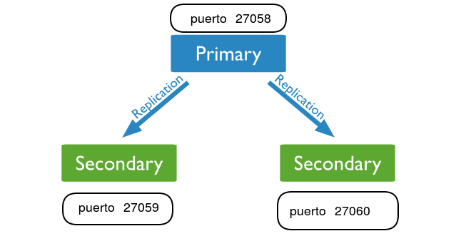

# Replicación

## Taller para generar réplicas en MongoDB

Crear tres carpetas:

* ~/data/mongodb/replication/cluster1
* ~/data/mongodb/replication/cluster2
* ~/data/mongodb/replication/cluster3

Definimos la replica para el primer cluster:

```bash
mongod --replSet rs_cluster1 --dbpath ~/data/mongodb/replication/cluster1 --logpath ~/data/mongodb/replication/cluster1/log.cluster1 --port 27058 --smallfiles --oplogSize 50 --fork
```

Y accedemos a una sesión de Mongo en el puerto correspondiente:

```bash
mongosh --port 27058
```

Definimos la variable de configuración apuntando al cluster 1, e iniciamos la réplica:

```js
> cfg={_id:"rs_cluster1",members:[{_id:0, host:"localhost:27058"}]}
{
	"_id" : "rs_cluster1",
	"members" : [
		{
			"_id" : 0,
			"host" : "localhost:27058"
		}
	]
}

> rs.initiate(cfg)
{ "ok" : 1 }
```

```js
db.prueba.insert({x:100})
db.prueba.insert({x:200})
db.prueba.insert({x:300,y:200})
db.prueba.find()
```

Volvemos a ejecutar en dos sesiones de consola (no de MongoDB), con la opción `--fork` liberamos el control al shell:

```bash
mongod --replSet rs_cluster1 --dbpath ~/data/mongodb/replication/cluster2 --logpath ~/data/mongodb/replication/cluster2/log.cluster2 --port 27059 --smallfiles --oplogSize 50 --fork
mongod --replSet rs_cluster1 --dbpath ~/data/mongodb/replication/cluster3 --logpath ~/data/mongodb/replication/cluster3/log.cluster3 --port 27060 --smallfiles --oplogSize 50 --fork
```

Y en la sesión de mongo apuntando al puerto 27058 hacemos:

```js
// mongosh --port 27058
cfg= {_id:"rs_cluster1",members:[{_id:0, host: "localhost:27058"},{_id:1,host: "localhost:27059"}, { _id:2, host: "localhost:27060" }], protocolVersion: 1 }
rs.reconfig(cfg)
```

Vemos ahora la configuración de las réplicas:

```js
rs_cluster1:PRIMARY> rs.conf()
{
	"_id" : "rs_cluster1",
	"version" : 78634,
	"protocolVersion" : NumberLong(1),
	"members" : [
		{
			"_id" : 0,
			"host" : "localhost:27058",
			"arbiterOnly" : false,
			"buildIndexes" : true,
			"hidden" : false,
			"priority" : 1,
			"tags" : {
				
			},
			"slaveDelay" : NumberLong(0),
			"votes" : 1
		},
		{
			"_id" : 1,
			"host" : "localhost:27059",
			"arbiterOnly" : false,
			"buildIndexes" : true,
			"hidden" : false,
			"priority" : 1,
			"tags" : {
				
			},
			"slaveDelay" : NumberLong(0),
			"votes" : 1
		},
		{
			"_id" : 2,
			"host" : "localhost:27060",
			"arbiterOnly" : false,
			"buildIndexes" : true,
			"hidden" : false,
			"priority" : 1,
			"tags" : {
				
			},
			"slaveDelay" : NumberLong(0),
			"votes" : 1
		}
	],
	"settings" : {
		"chainingAllowed" : true,
		"heartbeatIntervalMillis" : 2000,
		"heartbeatTimeoutSecs" : 10,
		"electionTimeoutMillis" : 10000,
		"catchUpTimeoutMillis" : 60000,
		"getLastErrorModes" : {
			
		},
		"getLastErrorDefaults" : {
			"w" : 1,
			"wtimeout" : 0
		},
		"replicaSetId" : ObjectId("5c88dbd531e2e061dcaa2d8b")
	}
}
```

Hacemos un insert:

```js
rs_cluster1:PRIMARY> db.prueba.insert({x:184})
WriteResult({ "nInserted" : 1 })
```

Abrimos una sesión en Robo3T, accediendo a localhost:27059 (la réplica):

```js
db.getCollection('prueba').find({})
```

## Demo



## Las réplicas son de solo lectura

> **Tip importante**: antes de ejecutar cualquier query en una réplica, debemos ejecutar el comando `rs.slaveOk()` o nos aparecerá el mensaje `not master and slaveOk=false`

Exactamente, si nos conectamos a alguna de las réplicas

```bash
mongsosh --port 27059
...
rs_cluster1:SECONDARY> 
```

E intentamos agregar un elemento a la colección `prueba`, obtendremos un mensaje de error:

```js
db.prueba.insert({x: 50, y: 20, z: 10})
WriteResult({ "writeError" : { "code" : 10107, "errmsg" : "not master" } })
```

Efectivamente, nos dice que no estamos en master.

## Resumen de la arquitectura



## Material

* [Conceptos de replicación](https://docs.mongodb.com/manual/replication/)
* [Deploy](https://docs.mongodb.com/manual/tutorial/deploy-replica-set/)

## Links

* [Volver al menú principal](../../README.md)
* [Volver a particionamiento](../particionamiento.md)
