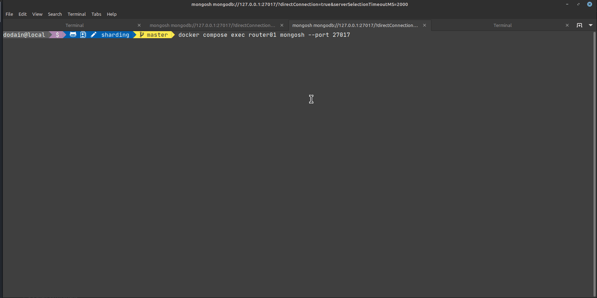
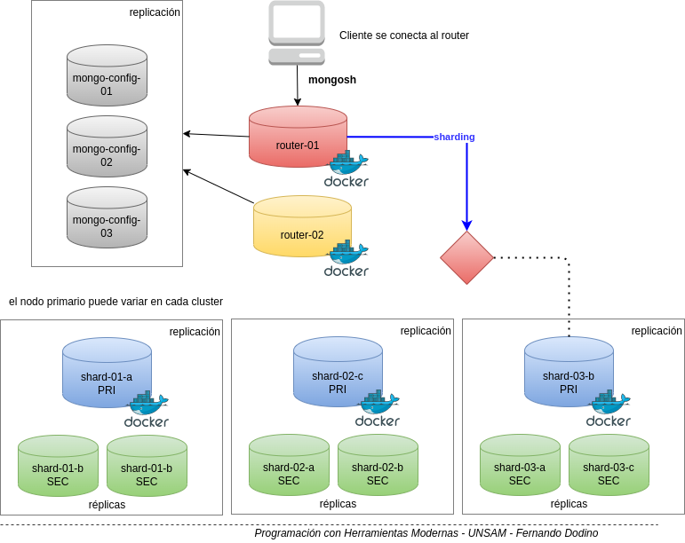
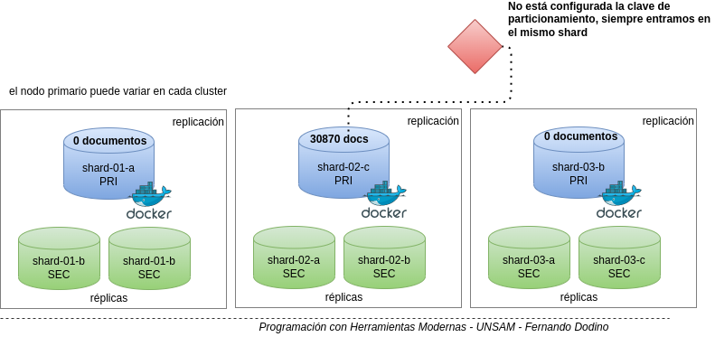
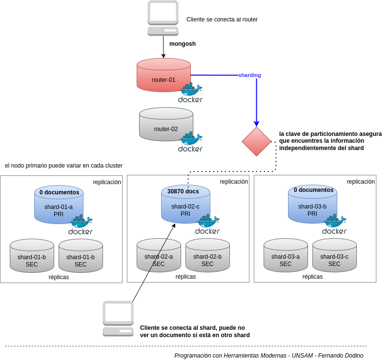

# Taller de Sharding

Este tutorial sigue los pasos de [este instructivo](https://github.com/minhhungit/mongodb-cluster-docker-compose) para trabajar con contenedores Docker de MongoDB. Si querés ver cómo se logra generar el sharding en forma manual, podés ver [esta página](./shardingTallerManual.md).

## Advertencia para Windows y MacOS

Si tenés algún inconveniente con definición de volúmenes en Mac o Windows, chequeá [esta página](https://github.com/docker-library/docs/blob/b78d49c9dffe5dd8b3ffd1db338c62b9e1fc3db8/mongo/content.md#where-to-store-data).

## Inicio del sharding

### 1. Levantando los contenedores

Desde la carpeta `sharding` en una terminal o Git Bash ejecutás:

```bash
docker compose up -d
```

Al final de la ejecución podés probar que los containers se levantaron correctamente:

```bash
docker ps
CONTAINER ID   IMAGE          COMMAND                  CREATED        STATUS          PORTS                                           NAMES
f94bddfe4c84   mongo:latest   "docker-entrypoint.s…"   14 hours ago   Up 21 minutes   0.0.0.0:27121->27017/tcp, :::27121->27017/tcp   mongo-config-03
787f970d7688   mongo:latest   "docker-entrypoint.s…"   14 hours ago   Up 21 minutes   0.0.0.0:27120->27017/tcp, :::27120->27017/tcp   mongo-config-02
4bd17eec81d0   mongo:latest   "docker-entrypoint.s…"   14 hours ago   Up 21 minutes   0.0.0.0:27119->27017/tcp, :::27119->27017/tcp   mongo-config-01
a665e6bf8339   mongo:latest   "docker-entrypoint.s…"   14 hours ago   Up 21 minutes   0.0.0.0:27122->27017/tcp, :::27122->27017/tcp   shard-01-node-a
54170db8265e   mongo:latest   "docker-entrypoint.s…"   14 hours ago   Up 21 minutes   0.0.0.0:27128->27017/tcp, :::27128->27017/tcp   shard-03-node-a
832b8f354424   mongo:latest   "docker-entrypoint.s…"   14 hours ago   Up 21 minutes   0.0.0.0:27125->27017/tcp, :::27125->27017/tcp   shard-02-node-a
22218f53ac7d   mongo:latest   "docker-entrypoint.s…"   14 hours ago   Up 21 minutes   0.0.0.0:27118->27017/tcp, :::27118->27017/tcp   router-02
ba446aad6d94   mongo:latest   "docker-entrypoint.s…"   14 hours ago   Up 21 minutes   0.0.0.0:27130->27017/tcp, :::27130->27017/tcp   shard-03-node-c
2ed1db76fef8   mongo:latest   "docker-entrypoint.s…"   14 hours ago   Up 21 minutes   0.0.0.0:27126->27017/tcp, :::27126->27017/tcp   shard-02-node-b
f7f42f4963f1   mongo:latest   "docker-entrypoint.s…"   14 hours ago   Up 21 minutes   0.0.0.0:27127->27017/tcp, :::27127->27017/tcp   shard-02-node-c
0fd0cecd1873   mongo:latest   "docker-entrypoint.s…"   14 hours ago   Up 21 minutes   0.0.0.0:27123->27017/tcp, :::27123->27017/tcp   shard-01-node-b
5ee2e51330ab   mongo:latest   "docker-entrypoint.s…"   14 hours ago   Up 21 minutes   0.0.0.0:27124->27017/tcp, :::27124->27017/tcp   shard-01-node-c
3b0d00d12ec2   mongo:latest   "docker-entrypoint.s…"   14 hours ago   Up 21 minutes   0.0.0.0:27117->27017/tcp, :::27117->27017/tcp   router-01
ad0a1f3efca0   mongo:latest   "docker-entrypoint.s…"   14 hours ago   Up 21 minutes   0.0.0.0:27129->27017/tcp, :::27129->27017/tcp   shard-03-node-b

```

### 2. Levantar los servers de configuración

```bash
docker compose exec configsvr01 sh -c "mongosh < /scripts/init-configserver.js"
```

### 3. Levantar shards (instancias de mongod)

```bash
docker compose exec shard01-a sh -c "mongosh < /scripts/init-shard01.js"
docker compose exec shard02-a sh -c "mongosh < /scripts/init-shard02.js"
docker compose exec shard03-a sh -c "mongosh < /scripts/init-shard03.js"
```

Cada shard va a tener un esquema de replicación de 3 instancias. Por ejemplo, el shard01 tendrá

- un nodo primario: shard01-a
- dos nodos secundarios: shard01-b y shard01-c

Recordá que lo podés ver conectándote a un nodo: `docker exec -it shard-01-node-a bash` y en `mongosh` chequear la configuración con `rs.status()`.

El nodo 2 tendrá como nodo primario shard02-a y como nodos secundarios shard02-b y shard02-c. Para conectarte al contenedor tenés que usar el nombre `shard-02-node-a`. En general los nombres de cada contenedor serán `shard-xx-node-y` donde `xx` es el número de shard (1, 2, 3), `y` es el nodo de réplica (a, b, c).

### 4. Levantar routers

Dejando pasar un cierto tiempo (45 segundos por ejemplo), levantamos todas las instancias:

```bash
docker compose exec router01 sh -c "mongosh < /scripts/init-router.js"
```

### 5. Verificación

Para estar seguros de que todo está correctamente configurado, ejecutamos:

```bash
docker compose exec router01 mongosh --port 27017
```

Y luego

```js
sh.status()
```

Aquí deberías ver que tenemos

- los 3 shards activos (rs-shard-01, rs-shard-02 y rs-shard-03)
- los servicios que tenemos activos (autosplit o splitter, balancer)
- y las bases de datos deben aparecer como particionadas



## Arquitectura del esquema de sharding

Podemos ver la arquitectura resultante (gracias al usuario `minhhungit` por la imagen):


## Insertando un set de datos

Nos conectaremos a continuación a alguna de las instancias del router, por ejemplo a `router-01`:



```bash
docker exec -it router-01 bash
```

Crearemos una database `finanzas` y cargaremos 30.000 facturas que se encuentran en [este archivo](./scripts/facturas.js). Lo bueno es que en la configuración de [docker compose](./docker-compose.yml) ya le dijimos que lo copie al contenedor, al directorio `scripts`. Vamos a chequear que el archivo `facturas.js` esté ahí:

```bash
ls -la /scripts
...
-rw-rw-r-- 1 1000 1000 13627495 Apr 30 14:56 facturas.js
```

Además de los otros scripts que utilizamos para levantar las instancias, está el archivo facturas. Ahora activamos el shell de mongo:

```bash
mongosh
```

y agregamos la información desde la nueva database:

```js
use finanzas
load("/scripts/facturas.js")
```

Ahora podés probar cuántas facturas hay cargadas:

```js
db
//finanzas -> confirmamos que la base es finanzas
db.facturas.countDocuments()
// 30870
```

Abrimos 3 ventanas, conectándonos cada una al shard 1, 2 ó 3 primario:

```bash
docker compose exec shard01-a mongosh
# fíjense que acá estamos usando shard01-a porque referenciamos a la definición de docker compose
# si no deberíamos hacer 
# docker exec -it shard-01-node-a bash
# porque `shard-01-node-a` es el nombre que le pusimos al contenedor

# y luego desde otra terminal (hay que chequear cuál es el nodo primario, o ejecutar `db.getMongo().setReadPref("secondary")`)
docker compose exec shard02-a mongosh
# y luego desde otra terminal
docker compose exec shard03-a mongosh
```

y vemos dónde están las facturas:

```js
use finanzas
db.facturas.countDocuments()
```

¡El resultado te sorprenderá! Pese a que activamos el sharding, todas las facturas están en un solo shard, mientras que el resto de los shards está vacío.




## Definiendo la shard key -> por rango

Volvamos al cliente que apunta al router:

```bash
docker exec -it router-01 bash
```

[Crearemos los índices](https://www.mongodb.com/docs/manual/reference/method/db.collection.createIndex/#mongodb-method-db.collection.createIndex) y activaremos el sharding, relacionando la **clave de particionamiento** con el índice que acabamos de generar:

```js
use finanzas

-- creamos el índice de facturas por región y condición de pago (1 -> ascendente)
db.facturas.createIndex({"cliente.region":1,"condPago":1})

-- habilitamos el sharding para la database finanzas
sh.enableSharding("finanzas")

-- definimos la clave por el índice que anteriormente generamos (región y condición de pago ascendente)
sh.shardCollection("finanzas.facturas", {"cliente.region":1,"condPago":1 },false)

-- vemos los chunks que se generaron
use config
db.chunks.find({}, {min:1,max:1,shard:1,_id:0,ns:1}).pretty()

-- corremos muuuuuchas veces más el mismo script (7 veces mínimo)
load("/scripts/facturas.js")
load("/scripts/facturas.js")
load("/scripts/facturas.js")
load("/scripts/facturas.js")
load("/scripts/facturas.js")
load("/scripts/facturas.js")
load("/scripts/facturas.js")
load("/scripts/facturas.js")
load("/scripts/facturas.js")
load("/scripts/facturas.js")
load("/scripts/facturas.js")
load("/scripts/facturas.js")
load("/scripts/facturas.js")
load("/scripts/facturas.js")
```

### Acceso por shard vs. acceso por router

Nos conectamos a cada shard para buscar una factura contado de CABA (fijate el script [`buscarFactura`](./scripts/buscarFactura.js) que creamos porque Mongo es muy molesto con el tema de tener que configurar la preferencia para las réplicas):

```bash
docker compose exec shard01-a sh -c "mongosh < /scripts/buscarFactura.js"
docker compose exec shard02-a sh -c "mongosh < /scripts/buscarFactura.js"
docker compose exec shard03-a sh -c "mongosh < /scripts/buscarFactura.js"
```

Fijate que si te conectás a un shard específico sólo vas a poder ver la información de ese shard particular. Esto es distinto si ejecutás la misma consulta en el router (proceso `mongos`), que es lo que deberíamos hacer normalmente:

```bash
docker compose exec router01 sh -c "mongosh < /scripts/buscarFactura.js"
docker compose exec router02 sh -c "mongosh < /scripts/buscarFactura.js"
```

Como ves, cualquiera de los routers son capaces de encontrar el documento dentro del conjunto de shards.



### La distribución todavía es desigual

Veamos ahora cómo está la distribución:

```bash
docker compose exec shard01-a sh -c "mongosh < /scripts/cuantasFacturas.js"
docker compose exec shard02-a sh -c "mongosh < /scripts/cuantasFacturas.js"
docker compose exec shard03-a sh -c "mongosh < /scripts/cuantasFacturas.js"
```

Hm... todavía vemos todo en un solo shard. Si preguntamos por la configuración de sharding: `db.facturas.getShardDistribution()` es posible que notes que hay un solo chunk:

```js
{
  data: '72.6MiB',
  docs: 246960,
  chunks: 1,
  'estimated data per chunk': '72.6MiB',
  'estimated docs per chunk': 246960
}
```

Es decir, todavía no se ejecutó el splitter. Podemos igualmente forzar un split manualmente, siempre desde el router01:

```js
sh.splitAt("finanzas.facturas", { "cliente.region": "CENTRO", condPago: "EFECTIVO"  })
```

Esto ahora produce que aparezcan nuevos chunks:

```js
sh.status()
// output, fijate en collections la cantidad de chunks que tenés, si son pocos es posible
// que el balancer los mantenga en el mismo shard porque es una operación que cuesta pasar
// todo un chunk de ~64 MB por la red
...
    collections: {
      'finanzas.facturas': {
        shardKey: { 'cliente.region': 1, condPago: 1 },
        unique: false,
        balancing: true,
        chunkMetadata: [ { shard: 'rs-shard-01', nChunks: 2 } ],
```

aunque no te garantiza que la información se distribuya en diferentes shards, eso depende de cuánta información estemos guardando, el tamaño de cada chunk, etc.

¿Podemos cambiar la clave a _hashed_? Eso no es posible una vez que definimos los shards:

```js
sh.shardCollection("finanzas.facturas", { "id": "hashed" })
MongoServerError: sharding already enabled for collection finanzas.facturas
```

## Otra oportunidad! Otra oportunidad!

Eliminemos la colección de facturas desde alguna de las instancias del router:

```bash
use finanzas
# TODO: remover la clave de particionamiento solamente
db.dropDatabase("facturas")
```

## Definiendo la shard key -> hashed

```js
use finanzas

-- creamos el índice de facturas por hash del número, lo que asegurará buena dispersión
db.facturas.ensureIndex({"nroFactura": "hashed"})

-- habilitamos el sharding para la database finanzas
sh.enableSharding("finanzas")

-- definimos la clave por el índice que anteriormente generamos (región y condición de pago ascendente)
sh.shardCollection("finanzas.facturas", {"nroFactura": "hashed" }, false)

-- corremos el mismo script varias veces
load("/scripts/facturas.js")
load("/scripts/facturas.js")
load("/scripts/facturas.js")
load("/scripts/facturas.js")
load("/scripts/facturas.js")
load("/scripts/facturas.js")
load("/scripts/facturas.js")
load("/scripts/facturas.js")
load("/scripts/facturas.js")
load("/scripts/facturas.js")

-- vemos los chunks que se generaron
use config
db.chunks.find({}, {min:1,max:1,shard:1,_id:0,ns:1}).pretty()
```

O bien, mucho más claro,

```js
use finanzas
db.facturas.getShardDistribution()
```

Y ahora sí:

```
Shard rs-shard-02 at rs-shard-02/shard02-a:27017,shard02-b:27017,shard02-c:27017
{
  data: '30.08MiB',
  docs: 102350,
  chunks: 2,
  'estimated data per chunk': '15.04MiB',
  'estimated docs per chunk': 51175
}
---
Shard rs-shard-03 at rs-shard-03/shard03-a:27017,shard03-b:27017,shard03-c:27017
{
  data: '29.71MiB',
  docs: 100990,
  chunks: 2,
  'estimated data per chunk': '14.85MiB',
  'estimated docs per chunk': 50495
}
---
Shard rs-shard-01 at rs-shard-01/shard01-a:27017,shard01-b:27017,shard01-c:27017
{
  data: '30.95MiB',
  docs: 105360,
  chunks: 2,
  'estimated data per chunk': '15.47MiB',
  'estimated docs per chunk': 52680
}
---
Totals
{
  data: '90.75MiB',
  docs: 308700,
  chunks: 6,
  'Shard rs-shard-02': [
    '33.14 % data',
    '33.15 % docs in cluster',
    '308B avg obj size on shard'
  ],
  'Shard rs-shard-03': [
    '32.74 % data',
    '32.71 % docs in cluster',
    '308B avg obj size on shard'
  ],
  'Shard rs-shard-01': [
    '34.1 % data',
    '34.13 % docs in cluster',
    '308B avg obj size on shard'
  ]
}
```

Podemos entrar en cada uno de los shards y ver cuántas facturas se generaron:

```bash
docker compose exec shard01-a sh -c "mongosh < /scripts/cuantasFacturas.js"
docker compose exec shard02-a sh -c "mongosh < /scripts/cuantasFacturas.js"
docker compose exec shard03-a sh -c "mongosh < /scripts/cuantasFacturas.js"
```

## Links

- http://juanroy.es/es/how-to-set-up-a-mongodb-sharded-cluster/
- https://www.bit.es/knowledge-center/mongodb-para-big-data-replicacion-y-sharding-iii/
- https://medium.com/@tudip/mongodb-sharding-replication-and-clusters-d95a6595bd2c
